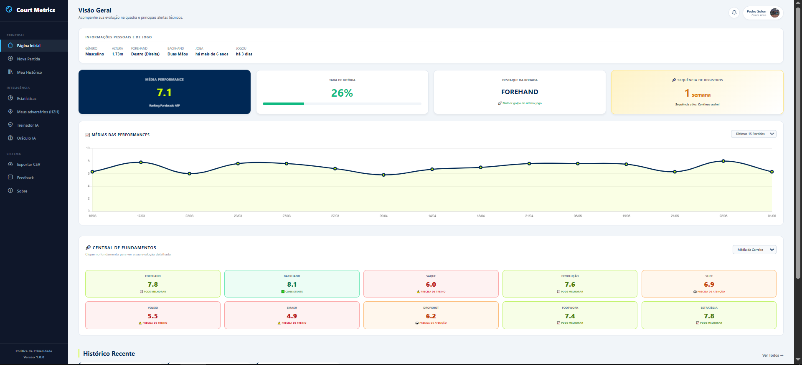
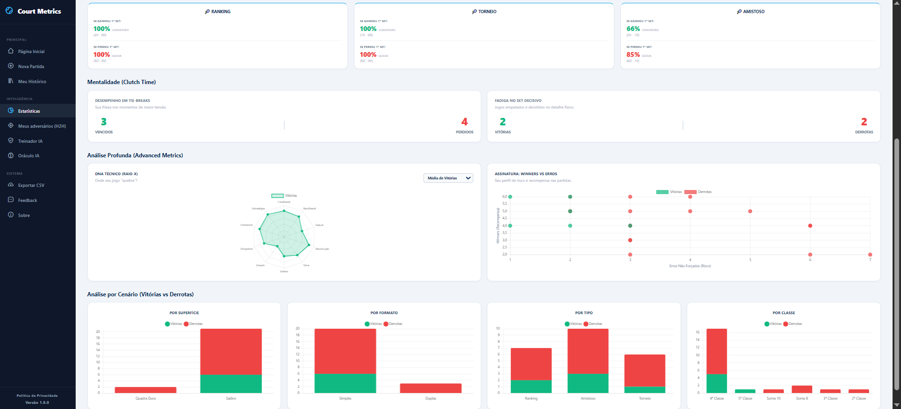
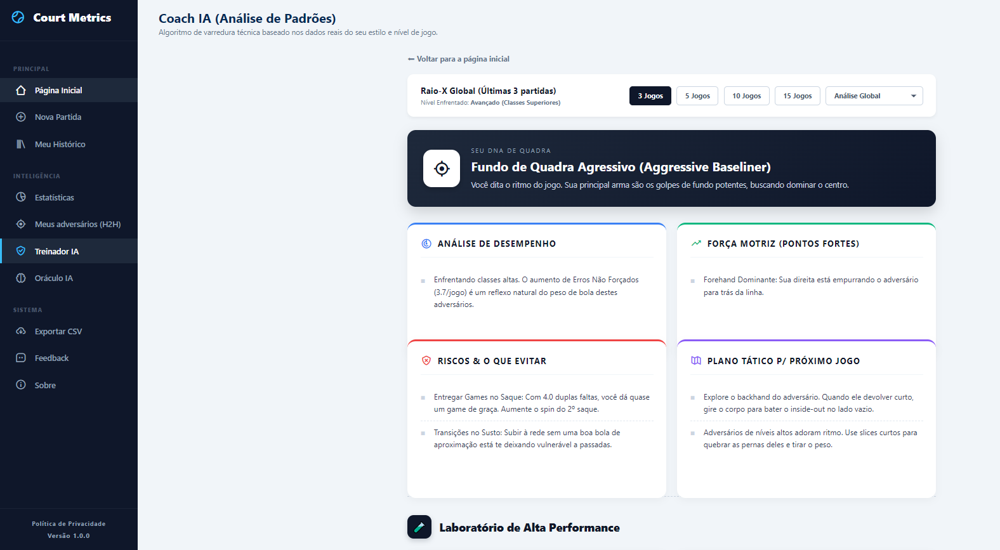
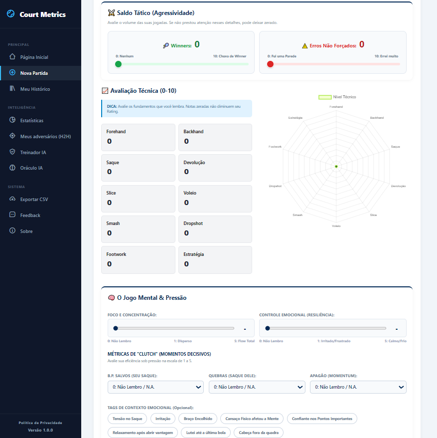

# 🎾 Court Metrics - Plataforma de análise de desempenho no Tênis

[](https://www.python.org/)
[](https://flask.palletsprojects.com/)
[](https://www.sqlite.org/)
[](https://scikit-learn.org/)
[](https://www.chartjs.org/)
[](https://courtmetrics.pythonanywhere.com)
[]()

🔗 **Acesse o site:** [courtmetrics.com.br](courtmetrics.com.br)

---

## 🔒 Aviso de Propriedade Intelectual & Disponibilidade de Código

O **Court Metrics** é uma solução de inteligência de produto e dados proprietária de ponta a ponta. Para mitigar riscos de plágio e proteger a propriedade intelectual dos algoritmos preditivos, do modelo de dados e das regras de negócio, **o código-fonte original é mantido em um repositório privado**.

Esta página pública funciona exclusivamente como o **Dossiê Técnico de Portfólio do Projeto**, detalhando minuciosamente as decisões de arquitetura de dados, pipeline de Machine Learning, engenharia de produto e design de métricas. 

### 💼 Nota para Recrutadores e Avaliadores:
Caso você esteja avaliando este projeto para uma oportunidade profissional e queira auditar a qualidade, os padrões de escrita, a semântica dos códigos, **o acesso temporário como colaborador do repositório privado será liberado imediatamente**.

Por favor, envie uma solicitação com seu usuário do GitHub para:
* **LinkedIn:** [Pedro Solon Assis](https://www.linkedin.com/in/pedrosolonassis/)
* **E-mail:** solonpedro21@gmail.com

---

## 📌 Visão Geral da Solução Analítica

O **Court Metrics** é uma plataforma analítica de dados voltada para o mapeamento, quantificação e diagnóstico preditivo de performance esportiva para tenistas. A solução captura dados brutos de partidas de tênis, trata inconsistências de inputs e os transforma em métricas analíticas e de inteligência artificial avançadas para extração de vantagens competitivas.

Diferente de aplicativos comuns de marcas esportivas, o sistema atua como um ecossistema de **Business Intelligence (BI) e Ciência de Dados** para o atleta, gerando índices ponderados de performance técnica, diagnósticos de comportamento sob pressão (*clutch analytics*) e simulação preditiva de probabilidade de vitória com base no histórico relacional do usuário.

---

## 📸 Screenshots
 
### Dashboard Principal - Visão Geral & KPIs

*KPIs em tempo real, gráfico de evolução de performance e Central de Fundamentos com classificação automática por nível técnico.*
 
### Módulo de Estatísticas Avançadas

*DNA Técnico (Radar Chart), Assinatura de Risco vs. Recompensa (Scatter Plot), análise de Clutch Time e Stacked Bar Charts por superfície, formato e categoria.*
 
### Coach IA - Dossiê Tático

*Algoritmo de varredura tática que classifica o estilo de jogo do atleta e gera análise de desempenho, pontos fortes, riscos e plano tático para o próximo jogo.*
 
### Registro de Partida - Coleta de Dados

*Formulário de captura com avaliação técnica em 10 fundamentos, Radar Chart interativo em tempo real, saldo tático e métricas mentais de clutch time.*
 
---

## 🚀 Como Executar Localmente
 
### Pré-requisitos
- Python 3.9+
- pip
### Instalação
 
```bash
# 1. Clone o repositório
git clone https://github.com/pedrosolonassis/court-metrics.git
cd court-metrics
 
# 2. Instale as dependências
pip install -r requirements.txt
 
# 3. Execute a aplicação
python app.py
```
 
Acesse `http://localhost:5000` no navegador.
 
### Dependências principais
 
```
Flask
Werkzeug
scikit-learn
numpy
```
 
---

## 🎲 Arquitetura de Dados & Modelagem Relacional

O backend utiliza o banco de dados relacional **SQLite3**. A estrutura foi desenhada garantindo integridade de dados através de chaves estrangeiras e indexação cronológica por ID de usuário (`user_id`).

### 🛠️ Esquema do Banco de Dados

O banco de dados é estruturado em quatro entidades principais:

```sql
-- 1. Tabela de Usuários (Cadastro de Perfis e Antropometria)
CREATE TABLE IF NOT EXISTS users (
    id INTEGER PRIMARY KEY AUTOINCREMENT,
    username TEXT UNIQUE NOT NULL,
    password TEXT NOT NULL,
    first_name TEXT, last_name TEXT, email TEXT, phone TEXT,
    birth_date TEXT, gender TEXT, playing_since TEXT,
    forehand_hand TEXT, backhand_type TEXT,
    height REAL, weight REAL, profile_pic TEXT
);

-- 2. Tabela de Partidas (Métricas Técnicas, Táticas e Mentais)
CREATE TABLE IF NOT EXISTS matches (
    id INTEGER PRIMARY KEY AUTOINCREMENT,
    opponent TEXT, categoria TEXT, match_type TEXT, surface TEXT,
    result TEXT, score TEXT, match_format TEXT, game_format TEXT,
    partner TEXT, opp_partner TEXT,
    forehand INTEGER, backhand INTEGER, serve INTEGER, first_serve INTEGER, second_serve INTEGER,
    double_faults INTEGER, return_serve INTEGER, slice INTEGER, volley INTEGER, smash INTEGER, dropshot INTEGER,
    footwork INTEGER, strategy INTEGER, winners INTEGER, unforced_errors INTEGER,
    performance_rating REAL, notes TEXT, match_date TEXT, user_id INTEGER,
    mental_focus INTEGER DEFAULT 0, mental_resilience INTEGER DEFAULT 0,
    clutch_bp_saved INTEGER DEFAULT 0, clutch_bp_won INTEGER DEFAULT 0,
    momentum_lost_streak INTEGER DEFAULT 0, mental_tags TEXT DEFAULT "",
    FOREIGN KEY (user_id) REFERENCES users (id)
);

-- 3. Tabela de Feedbacks (Análise de Bugs e Melhorias do Produto)
CREATE TABLE IF NOT EXISTS feedback (
    id INTEGER PRIMARY KEY AUTOINCREMENT,
    user_id INTEGER, feedback_type TEXT, subject TEXT, description TEXT,
    priority TEXT, image_path TEXT, created_at TIMESTAMP DEFAULT CURRENT_TIMESTAMP,
    FOREIGN KEY (user_id) REFERENCES users (id)
);

-- 4. Tabela de Notificações (Engajamento Baseado em Eventos)
CREATE TABLE IF NOT EXISTS notifications (
    id INTEGER PRIMARY KEY AUTOINCREMENT,
    user_id INTEGER, message TEXT, link TEXT, is_read INTEGER DEFAULT 0,
    created_at DATETIME DEFAULT CURRENT_TIMESTAMP,
    FOREIGN KEY (user_id) REFERENCES users (id)
);
```

**🛡️ Migração Silenciosa:** O pipeline conta com tratamento de `sqlite3.OperationalError`. Em instâncias com bancos legados, o sistema injeta colunas analíticas em tempo de execução via `ALTER TABLE` sem corromper o histórico de dados pré-existente.

---

## 📐 Pipeline de Dados & Feature Engineering

Para fornecer análises estatísticas precisas e alimentar os motores de Machine Learning, a plataforma implementa transformações analíticas complexas direto na ingestão de dados:

### 1. Índice Ponderado de Performance (Performance Rating)
Para evitar que uma nota ruim em um golpe secundário pouco executado (ex: dropshot ou slice) afete o índice geral, a plataforma calcula uma **média harmônico-ponderada** que ignora valores zerados (não-avaliados) e distribui os pesos por relevância tática estrutural:

| Grupo | Fundamentos | Peso |
|---|---|---|
| Golpes Primários | Forehand, Backhand, Saque | 50% |
| Fundamentos Secundários | Devolução, Footwork, Estratégia | 30% |
| Golpes Específicos | Slice, Voleio, Smash, Dropshot | 20% |

### 2. Pipeline de Exportação de Dados com Variáveis Derivadas (ETL)
A rota `/export` executa um processo de extração, transformação e carregamento (ETL) que converte o banco relacional em um arquivo `.csv` analítico (com BOM `\ufeff` para compatibilidade com Excel e Pandas), enriquecendo o dataset com variáveis derivadas:

| Coluna Derivada | Descrição |
|---|---|
| `resultado_binario` | Transforma variável categórica em binária (1=Vitória, 0=Derrota) — pronto para modelos de classificação |
| `saldo_tatico` | Agressividade líquida: `winners - unforced_errors` |
| `fundamento_medio` | Média aritmética excluindo valores nulos |
| `mental_medio` | Média dos indicadores mentais válidos |
| `semana_ano` | Formato ISO `YYYY-Www` - facilita séries temporais em BI |
| `mes_ano` | Formato `YYYY-MM` - facilita agrupamentos mensais |

### 3. Algoritmo de Consistência Temporal (Gamification Streak)
O sistema conta com um motor estatístico que agrupa os dados de partidas por datas cronológicas, converte qualquer dia inserido para a segunda-feira daquela respectiva semana e calcula iterativamente para trás o streak (sequência) de semanas seguidas em que o usuário manteve-se ativo, gerando classificações substituindo o comportamento comum por alertas visuais ponderados (inactive, active, hot, elite).

## 📊 Dashboards & Data Visualization
A camada de front-end do Court Metrics foi desenhada sob os princípios de **Scannability** (Escaneabilidade) e alta densidade de dados, traduzindo matrizes complexas em outputs visuais interativos através da biblioteca **Chart.js**:

### 1. Gráficos Computados em Tempo de Execução

**DNA Técnico (Radar Chart):** Mapeia os 10 eixos de fundamentos em vitórias vs. derrotas. Valores zerados são convertidos para `null` no JavaScript (`spanGaps: false`), impedindo distorções na malha do gráfico por golpes não-avaliados.

**Assinatura de Risco vs. Recompensa (Scatter Plot):** Plota a distribuição espacial das partidas cruzando o volume de Winners (Eixo Y - Recompensa) com Erros Não Forçados (Eixo X - Risco), permitindo identificar visualmente o quadrante de eficiência tática do jogador.

**Análise de Cenários Combinados (Stacked Bar Charts):** Agrega dados volumétricos por empilhamento para avaliar o desempenho do atleta sob segmentações específicas: Por Superfície (Saibro vs. Dura), Por Formato (Simples vs. Duplas) e Por Classe/Categoria.

**Gráfico de Evolução com Médias Móveis:** Filtros dinâmicos JavaScript (`updateFundamentals`, `updateEvolutionChart`) que recalculam médias em tempo de execução para janelas de Últimas 3, 5, 10 ou 15 partidas.

### 2. Tratamento Contraintuitivo e Preenchimento Automatizado

**Filtros Dinâmicos de Janela Temporal:** O dashboard implementa funções JavaScript (updateFundamentals, updateEvolutionChart) que interceptam o array master de dados e recalculam médias móveis em tempo de execução para janelas de Últimas 3, 5, 10 ou 15 partidas.

**Regex Score Parser:** O sistema conta com uma lógica de expressões regulares (re.sub no Python e regex no JS) desenvolvida para quebrar e interpretar strings de placares no padrão oficial de federações (ex: 6/4 6/7(5) [10/8]). O algoritmo extrai os games puros, identifica de quem foi o tie-break e preenche automaticamente a interface visual sem quebrar o fluxo da aplicação.

## 🧠 Motores de IA Avançada & Algoritmos de Diagnóstico
A inteligência analítica da plataforma está dividida em dois motores de processamento hospedados no backend:

### 1. Oráculo IA: Simulação de Cenários Preditivos

O motor preditivo utiliza o pacote scikit-learn para rodar um modelo de Regressão Logística treinado dinamicamente com o histórico real do usuário.

```python
from sklearn.linear_model import LogisticRegression
from sklearn.preprocessing import StandardScaler
 
# Features: superfície, performance rating, agressividade, foco mental, resiliência
X = [[is_saibro, rating, winners/(erros+1), mental_focus, mental_resilience], ...]
 
scaler = StandardScaler()
X_scaled = scaler.fit_transform(X)
 
model = LogisticRegression(class_weight='balanced')
model.fit(X_scaled, y)
```

**Pipeline do Modelo:** O script extrai as variáveis de cada partida, padroniza as escalas utilizando o StandardScaler (para balancear o peso de notas técnicas com taxas de agressividade) e aplica pesos equilibrados de classe (class_weight='balanced') para evitar vieses caso o usuário tenha um histórico com muito mais vitórias do que derrotas.

**Handicap de Discrepância de Classe:** O algoritmo cruza o "Nível Verdadeiro" do usuário (média ponderada da hierarquia de categorias enfrentadas) com a classe selecionada no simulador. Caso haja um abismo técnico entre as classes, o motor aplica um handicap matemático punitivo ou bonificador de 35% por nível de diferença, travando a probabilidade final entre 1% e 99%.

```
probabilidade_final = prob_logistica + (nivel_usuario - nivel_simulado) * 35.0
```

**Explainable AI (XAI):** O sistema não entrega apenas uma probabilidade fria. Ele implementa inteligência explicativa, decompondo os coeficientes do modelo em bullets de texto claro para o usuário entender o impacto exato do seu saldo tático e da sua projeção mental no resultado predito.

### 2. Coach IA: Algoritmo de Varredura Tática (Dock Principal)
O script processa o histórico de dados sob filtros condicionais avançados para gerar uma árvore de tomadas de decisão baseada no perfil estatístico do jogador:

**Classificação de DNA de Quadra:** Árvore de decisão baseada em médias de fundamentos que classifica o estilo em perfis como *Aggressive Baseliner*, *Counterpuncher*, *Serve & Volley*, *All-Court* e variantes táticas.

**Clutch Time Metrics:** Mapeia eficiência sob pressão, processando aproveitamento em break points salvos/conquistados e isolando ocorrências de *Momentum Lost* (apagão tático).

**Prescrição Automática de Treino (Drills):** O algoritmo identifica o menor estimador técnico - `min(key=notas_validas.get)` - e injeta no front-end uma recomendação de drill específico para mitigar a fraqueza identificada.

**Análise de Nêmesis Isolado:** A rota do treinador permite isolar a varredura para um oponente específico. O sistema recalcula as taxas de vitória, saldo e resistência em tie-breaks, gerando um "Dossiê Tático" focado em quebrar o padrão de jogo daquele rival específico.

**Termômetro de Circuito (Detecção de Anomalias):** O módulo executa uma análise cruzada de taxa de vitória (Win Rate) por pesos de categoria (Classes). Ele aplica uma lógica de detecção de anomalias para identificar um comportamento contraintuitivo clássico do tênis amador: se o Win Rate do usuário for menor em classes inferiores do que em classes avançadas, o sistema dispara um insight alertando que o jogador sofre de Falta de Ritmo (comete mais erros não-forçados tentando gerar força contra bolas lentas e flutuantes enviadas por oponentes iniciantes).

## 🖨️ Pipeline de Engenharia de Relatórios (Client-Side Export)
Para garantir flexibilidade no consumo das informações pelo usuário ou seu treinador físico, a plataforma disponibiliza dois pipelines de exportação de dados de ponta:

**Relatório Executivo em PDF (Client-Side):** Arquitetura baseada em `html2canvas` + `jsPDF` que renderiza o DOM em canvas de alta definição (escala 2x) e executa quebra de página dinâmica em vetor. O arquivo é nomeado automaticamente no padrão `vs_Adversario_DD-MM-AAAA.pdf`.

**Central de Confrontos Diretos (Head-to-Head Analytics):** Agregações SQL com cláusulas `CASE WHEN` dinâmicas que consolidam o histórico de rivais — incluindo mesclagem de nomes em partidas de duplas — para comparar desempenho histórico geral versus rendimento específico contra cada rival.

## 🏗️ Stack Tecnológica
 
| Camada | Tecnologia |
|---|---|
| Backend | Python, Flask, Werkzeug |
| Banco de Dados | SQLite3 (com migrações em runtime) |
| Machine Learning | scikit-learn (Logistic Regression, StandardScaler) |
| Autenticação | Werkzeug Security (password hashing) |
| Frontend | HTML5, CSS3, JavaScript (Vanilla) |
| Visualização | Chart.js (Radar, Scatter, Line, Stacked Bar) |
| Templating | Jinja2 |
| Exportação | html2canvas, jsPDF |
| Upload de Imagem | Cropper.js |
| Deploy | PythonAnywhere |
 
---
 
## 💡 Decisões de Design & Aprendizados
 
- **Dados dispersos:** O principal desafio foi lidar com campos não-avaliados (valor `0`) sem contaminar médias e gráficos - resolvido filtrando zeros na camada de agregação e convertendo para `null` no JavaScript.
- **ML com dados limitados:** Com poucos registros por usuário, `class_weight='balanced'` e o sistema de handicap por classe foram essenciais para garantir predições úteis mesmo com distribuições assimétricas.

### Próximas Evoluções
 
- [ ] API REST para consumo mobile
- [ ] Exportação de dados para integração com Power BI / Tableau
- [ ] Modelo de ML com mais features

---

## 👨‍💻 Autor

**Pedro Solon Assis Ramelli**
<br>Graduado em Relações Internacionais - Universidade Estadual da Paraíba (UEPB)

[](https://www.linkedin.com/in/pedrosolonassis/)
[](mailto:solonpedro21@gmail.com)
[](https://courtmetrics.pythonanywhere.com)

## 📁 Estrutura do Repositório

```text
COURT_METRICS/
│
├── database.db                             # Banco de dados relacional SQLite3 local
├── app.py                                  # Script master backend (Rotas Flask, pipelines e IA)
│
├── static/
│   ├── style.css                           # Arquivo master de folhas de estilo e UI responsiva
│   └── uploads/                            # Repositório local de uploads do sistema
│       ├── feedback/                       # Imagens e prints anexados a relatórios de erros
│       └── profiles/                       # Fotos de perfil recortadas dos atletas
│
├── templates/                              # Camada de Front-end (Templates Jinja2 e UI)
│   ├── 404.html                            # Página de erro customizada (Tratamento de rotas nulas)
│   ├── adversarios.html                    # Dashboard central do Head-to-Head (H2H)
│   ├── base.html                           # Estrutura base da aplicação com Favicon inline PWA
│   ├── compare.html                        # Sobreposição gráfica e cálculo de delta de performance
│   ├── edit_match.html                     # Edição de dados e recalibração de métricas
│   ├── feedback.html                       # Formulário estruturado com priorização de bugs
│   ├── fundamento.html                     # Gráfico de evolução de série móvel de notas técnicas
│   ├── h2h_detail.html                     # Dossiê tático contra rivais específicos
│   ├── history.html                        # Central de filtros aplicados ao histórico de carreira
│   ├── index.html                          # Dashboard master (KPIs, Streaks e Gráficos de Linha)
│   ├── insights.html                       # Central de estatísticas avançadas e análise de cenários
│   ├── login.html                          # Interface de autenticação segura
│   ├── match_details.html                  # Relatório analítico detalhado da partida e exportação PDF
│   ├── new_match.html                      # Interface LetzPlay Score Capture para novos registros
│   ├── perfil.html                         # Configurações de perfil com integração ao Cropper.js
│   ├── privacidade.html                    # Termos legais e política de proteção de dados
│   ├── register.html                       # Criação de contas e perfis de atletas
│   ├── select_compare.html                 # Interface de seleção para cruzamento de partidas
│   ├── simulador.html                      # Oráculo IA (Modelo preditivo de Regressão Logística)
│   ├── sobre.html                          # Metadados de versão e informações do ecossistema
│   └── treinador.html                      # Dossiê tático gerado pelo algoritmo de IA
│
├── .gitignore
├── app.py                                  # Script master backend (Rotas Flask, pipelines ETL e IA)
├── database.db                             # Banco de dados relacional SQLite3 local
